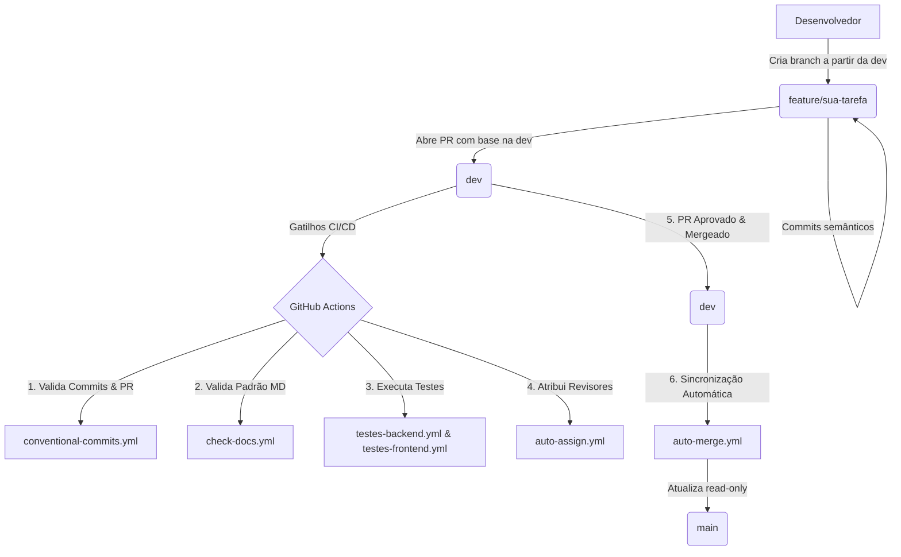

# Guia de Governança Git e Fluxo de Branches - AcadEvent

- Versão: 1.1
- Data: 2026-08-06
- Autor: José Carlos da Silva Filho (SPM)
- Revisores: —

---

## 1. Contexto

Este documento estabelece as diretrizes de versionamento, fluxo de trabalho em Git e governança de código para o monorepo do **AcadEvent**.

O repositório adota uma esteira de **CI/CD automatizada via GitHub Actions** que valida Pull Requests, executa suítes de testes isoladas para o backend e frontend, verifica a conformidade da documentação e realiza a sincronização automática entre a branch principal de desenvolvimento (`dev`) e a branch de produção (`main`), que opera em modo **read-only** (somente leitura).

---

## 2. O Fluxo de Branches

A ramificação do repositório foi desenhada para garantir isolamento de contexto, segurança na integração contínua e atualização automatizada da produção.



### Tabela de Branches

| Branch | Papel | Como Recebe Commits |
| --- | --- | --- |
| `main` | Código em produção, estável e pronto para deploy. **(Read-Only)** | **Somente via Sincronização Automática** (`auto-merge.yml`) a partir da branch `dev`. Pushes e PRs diretos são bloqueados. |
| `dev` | Branch principal de integração e desenvolvimento de funcionalidades. | **Somente via Pull Request (PR)** originados de branches de funcionalidade (`feature/*`, `fix/*`, `docs/*`, etc.). |
| `feature/*` / `fix/*` / `docs/*` / `**/*` | Branches temporárias de trabalho individual ou de squad. | **Commits diretos dos desenvolvedores**. Devem ser **obrigatoriamente criadas a partir da branch `dev`** e seguir o padrão Conventional Commits. |

---

## 3. Como Implementar Algo Novo

Para desenvolver uma nova funcionalidade, correção ou documentação no projeto, siga o passo a passo:

### Passo 1: Atualizar a branch local `dev`
```bash
git checkout dev
git pull origin dev
```

### Passo 2: Criar uma branch de funcionalidade a partir da `dev`
```bash
# Nomenclaturas recomendadas: feature/nome-da-feature, fix/nome-do-bug, docs/nome-da-doc
git checkout -b feature/cadastro-usuario
```

### Passo 3: Fazer alterações e commitar no padrão semântico
```bash
git add .
git commit -m "feat(cadastro): adiciona validacao de email no formulario"
```

### Passo 4: Publicar a branch no remoto e abrir PR
```bash
git push -u origin feature/cadastro-usuario
```
Em seguida, acesse o GitHub e abra um Pull Request apontando como **base: `dev`**.

---

## 4. Escrevendo Testes

### Backend (NestJS / Jest)
Os testes do backend devem ser colocados ao lado do código ou na pasta `test/` com extensão `.spec.ts`.

#### Exemplo de Teste Unitário (`src/atividades/atividades.service.spec.ts`):
```typescript
import { Test, TestingModule } from '@nestjs/testing';
import { AtividadesService } from './atividades.service';

describe('AtividadesService', () => {
  let service: AtividadesService;

  beforeEach(async () => {
    const module: TestingModule = await Test.createTestingModule({
      providers: [AtividadesService],
    }).compile();

    service = module.get<AtividadesService>(AtividadesService);
  });

  it('deve retornar a lista de atividades', async () => {
    const resultado = await service.findAll();
    expect(resultado).toBeDefined();
  });
});
```

Para rodar os testes do backend localmente:
```bash
cd backend
npm test
```

### Frontend (Next.js / React)
Os testes do frontend devem ser criados com a extensão `.test.tsx` ou `.spec.tsx`.

#### Exemplo de Teste de Componente (`src/components/Button.test.tsx`):
```tsx
import { render, screen } from '@testing-library/react';
import Button from './Button';

describe('Button Component', () => {
  it('deve renderizar o texto correto', () => {
    render(<Button>Enviar</Button>);
    expect(screen.getByText('Enviar')).toBeInTheDocument();
  });
});
```

Para rodar os testes do frontend localmente:
```bash
cd frontend
npm test
```

---

## 5. Os Workflows do CI/CD

| Arquivo | Dispara Em | O que faz |
| --- | --- | --- |
| `auto-assign.yml` | PRs para branches diferentes de `main` | Atribui automaticamente revisores aos Pull Requests abertos. |
| `auto-merge.yml` | Push na branch `dev` | Sincroniza automaticamente as alterações da branch `dev` para a branch `main` (read-only). |
| `check-docs.yml` | PRs ou Pushes alterando arquivos `.md` | Verifica se os arquivos de documentação alterados contêm o cabeçalho obrigatório de metadados. |
| `conventional-commits.yml` | Pushes em branches de trabalho ou PRs | Valida se as mensagens de commit e o título do PR seguem a especificação Conventional Commits. |
| `testes-backend.yml` | PR para `dev` ou Push em branches de trabalho | Prepara o ambiente Node.js, gera o Prisma Client e executa a suíte de testes do backend. |
| `testes-frontend.yml` | PR para `dev` ou Push em branches de trabalho | Prepara o ambiente Node.js e executa a suíte de testes do frontend. |

---

## 6. Convenção de Commit (Conventional Commits)

Todos os commits e títulos de Pull Requests devem seguir estritamente o padrão:

$$\text{tipo(escopo opcional)}: \text{descrição clara em letras minúsculas}$$

### Tipos Permitidos

- `feat`: Nova funcionalidade para o usuário.
- `fix`: Correção de um erro ou bug.
- `docs`: Alteração exclusiva em documentação.
- `style`: Formatação, ponto e vírgula esquecido, sem alteração de código produtivo.
- `refactor`: Reestruturação de código sem alterar comportamento externo.
- `perf`: Mudança de código focada em melhoria de performance.
- `test`: Adição ou correção de testes unitários/integração.
- `build`: Alterações que afetam o sistema de build ou dependências externas.
- `ci`: Alterações em arquivos de configuração de CI/CD (GitHub Actions).
- `chore`: Outras alterações que não modificam arquivos de código ou teste.
- `revert`: Reversão de um commit anterior.

### Exemplos Válidos
- `feat(autenticacao): adiciona login via JWT`
- `fix(backend): corrige calculo de carga horaria no certificado`
- `docs(api): atualiza especificacao dos endpoints de eventos`
- `chore(deps): atualiza versao do prisma para 7.8.0`

---

## 7. O que NÃO fazer

| Ação Proibida | Por que não fazer? (Consequências) |
| --- | --- |
| **Commit ou Push direto nas branches `main` ou `dev`** | A branch `main` é estritamente **read-only** (atualizada automaticamente a partir da `dev`). Pushes diretos na `dev` contornam a esteira de testes e revisões de código via PR. |
| **Criar branches de trabalho a partir da branch `main`** | Todas as novas branches devem obrigatoriamente ser criadas a partir da branch `dev`. Criar a partir da `main` pode gerar inconsistências de histórico. |
| **Abrir PR com título fora do padrão Conventional Commits** | O workflow `conventional-commits.yml` falhará imediatamente e o PR não poderá ser mergeado. |
| **Criar/Editar arquivos `.md` sem o cabeçalho obrigatório** | O workflow `check-docs.yml` falhará na verificação de metadados (`Versão`, `Data`, `Autor`, `Revisores`, `---`), bloqueando a integração. |

