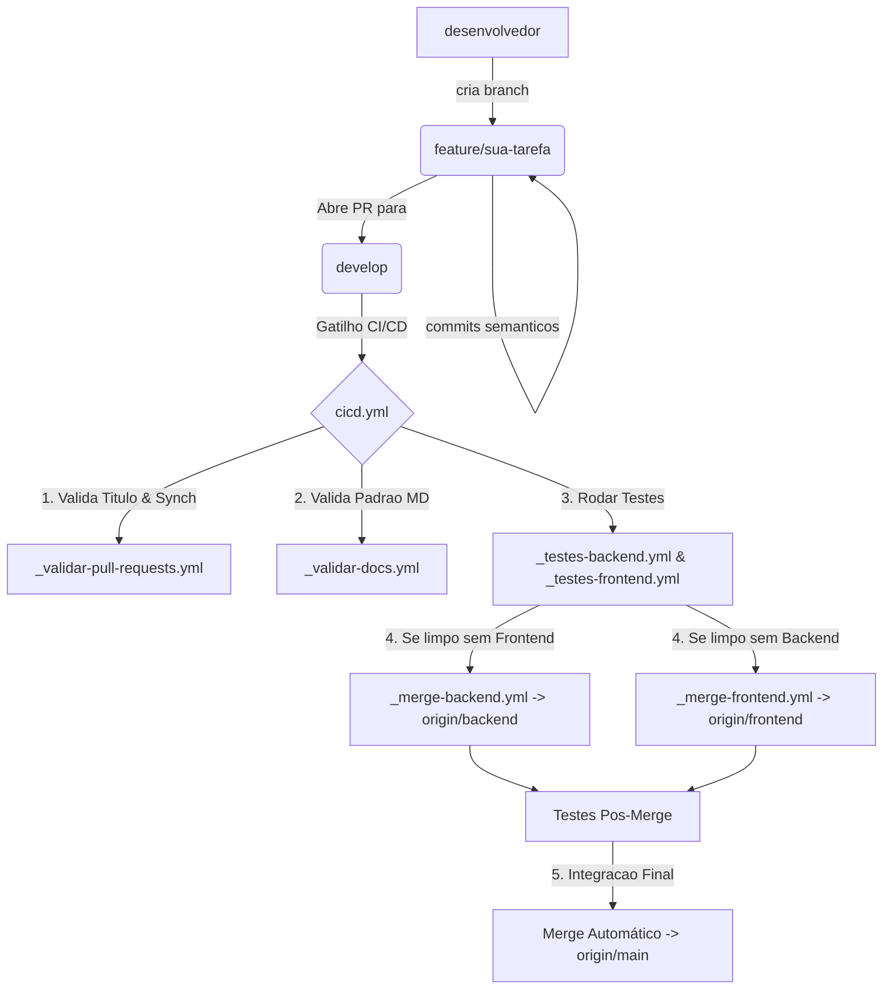

# Guia de Governança Git e Fluxo de Branches - AcadEvent

Versão: 1.0
Data: 2026-07-30
Autor: José Carlos da Silva Filho (SPM)
Revisores: —

---

## 1. Contexto

Este documento estabelece as diretrizes de versionamento, fluxo de trabalho em Git (Git Flow adaptado) e governança de código para o monorepo do **AcadEvent**.

O repositório adota uma esteira de **CI/CD automatizada via GitHub Actions** que valida Pull Requests, executa suítes de testes isoladas para o backend e frontend, verifica a conformidade da documentação e realiza merges automáticos semânticos entre as branches de contexto (`backend`, `frontend`, `docs`) até a consolidação na branch de produção (`main`).

---

## 2. O Fluxo de Branches

A ramificação do repositório foi desenhada para garantir isolamento de contexto, segurança na integração contínua e rastreabilidade total.



### Tabela de Branches

| Branch | Papel | Como Recebe Commits |
| --- | --- | --- |
| `main` | Código em produção, estável e pronto para deploy. | **Somente via Merge Automático** do pipeline `cicd.yml` após aprovação de testes. |
| `develop` | Branch principal de integração de funcionalidades em desenvolvimento. | **Somente via Pull Request (PR)** originados de branches de funcionalidade (`feature/*`, `fix/*`, etc.). |
| `backend` | Branch espelho contendo a evolução exclusiva da camada de backend. | **Somente via Merge Automático** (`_merge-backend.yml`) quando o PR não contiver arquivos de frontend. |
| `frontend` | Branch espelho contendo a evolução exclusiva da camada de frontend. | **Somente via Merge Automático** (`_merge-frontend.yml`) quando o PR não contiver arquivos de backend. |
| `docs` | Branch dedicada à consolidação de documentações oficiais do projeto. | **Via Merge Automático** do pipeline `cicd.yml` ou PRs específicos de documentação. |
| `feature/*` / `fix/*` / `**/*`| Branches temporárias de trabalho individual ou de squad. | **Commits diretos dos desenvolvedores** seguindo o padrão Conventional Commits. |

---

## 3. Como Implementar Algo Novo

Para desenvolver uma nova funcionalidade ou correção no projeto, siga o passo a passo:

### Passo 1: Atualizar a branch local `develop`
```bash
git checkout develop
git pull origin develop
```

### Passo 2: Criar uma branch de funcionalidade
```bash
# Nomenclaturas recomendadas: feature/nome-da-feature, fix/nome-do-bug, docs/nome-da-doc
git checkout -b feature/cadastro-usuario
```

### Passo 3: Fazer alterações e commitar no padrão semântico
```bash
git add .
git commit -m "feat(cadastro): adiciona validacao de email no formulario"
```

### Passo 4: Publicar a branch no remoto e abrir PR
```bash
git push -u origin feature/cadastro-usuario
```
Em seguida, acesse o GitHub e abra um Pull Request apontando como **base: `develop`**.

---

## 4. Escrevendo Testes

### Backend (NestJS / Jest)
Os testes do backend devem ser colocados ao lado do código ou na pasta `test/` com extensão `.spec.ts`.

#### Exemplo de Teste Unitário (`src/atividades/atividades.service.spec.ts`):
```typescript
import { Test, TestingModule } from '@nestjs/testing';
import { AtividadesService } from './atividades.service';

describe('AtividadesService', () => {
  let service: AtividadesService;

  beforeEach(async () => {
    const module: TestingModule = await Test.createTestingModule({
      providers: [AtividadesService],
    }).compile();

    service = module.get<AtividadesService>(AtividadesService);
  });

  it('deve retornar a lista de atividades', async () => {
    const resultado = await service.findAll();
    expect(resultado).toBeDefined();
  });
});
```

Para rodar os testes do backend localmente:
```bash
cd backend
npm test
```

### Frontend (Next.js / React)
Os testes do frontend devem ser criados com a extensão `.test.tsx` ou `.spec.tsx`.

#### Exemplo de Teste de Componente (`src/components/Button.test.tsx`):
```tsx
import { render, screen } from '@testing-library/react';
import Button from './Button';

describe('Button Component', () => {
  it('deve renderizar o texto correto', () => {
    render(<Button>Enviar</Button>);
    expect(screen.getByText('Enviar')).toBeInTheDocument();
  });
});
```

Para rodar os testes do frontend localmente:
```bash
cd frontend
npm test
```

---

## 5. Os Workflows do CI/CD

| Arquivo | Dispara Em | O que faz |
| --- | --- | --- |
| `_validar-pull-requests.yml` | Pull Request para `develop` ou `workflow_call` | Valida se o título do PR segue o padrão Conventional Commits e se a branch está atualizada com a `develop`. |
| `_validar-docs.yml` | Pull Request alterando `.md` ou `workflow_call` | Verifica se os arquivos `.md` modificados seguem o formato de cabeçalho obrigatório (ignora `README.md` da raiz). |
| `_testes-backend.yml` | Alterações em `backend/**` ou `workflow_call` | Monta o ambiente Node.js, instala dependências, gera o Prisma Client e executa `npm test` no backend. |
| `_testes-frontend.yml` | Alterações em `frontend/**` ou `workflow_call` | Monta o ambiente Node.js, instala dependências e executa os testes do frontend de forma graciosa. |
| `_merge-backend.yml` | Invocado via `cicd.yml` / `workflow_call` | Efetua o merge automático de `develop` para `backend` caso não haja arquivos do frontend no PR. |
| `_merge-frontend.yml` | Invocado via `cicd.yml` / `workflow_call` | Efetua o merge automático de `develop` para `frontend` caso não haja arquivos do backend no PR. |
| `cicd.yml` | PR ou Push na branch `develop` | Orquestra a execução em cadeia de todas as validações, suítes de testes e merges automáticos finais para a `main`. |

---

## 6. Convenção de Commit (Conventional Commits)

Todos os commits e títulos de Pull Requests devem seguir estritamente o padrão:

$$\text{tipo(escopo opcional)}: \text{descrição clara em letras minúsculas}$$

### Tipos Permitidos

- `feat`: Nova funcionalidade para o usuário.
- `fix`: Correção de um erro ou bug.
- `docs`: Alteração exclusiva em documentação.
- `style`: Formatação, ponto e vírgula esquecido, sem alteração de código produtivo.
- `refactor`: Reestruturação de código sem alterar comportamento externo.
- `perf`: Mudança de código focada em melhoria de performance.
- `test`: Adição ou correção de testes unitários/integração.
- `build`: Alterações que afetam o sistema de build ou dependências externas.
- `ci`: Alterações em arquivos de configuração de CI/CD (GitHub Actions).
- `chore`: Outras alterações que não modificam arquivos de código ou teste.
- `revert`: Reversão de um commit anterior.

### Exemplos Válidos
- `feat(autenticacao): adiciona login via JWT`
- `fix(backend): corrige calculo de carga horaria no certificado`
- `docs(api): atualiza especificacao dos endpoints de eventos`
- `chore(deps): atualiza versao do prisma para 7.8.0`

---

## 7. O que NÃO fazer

| Ação Proibida | Por que não fazer? (Consequências) |
| --- | --- |
| **Commit direto nas branches `main`, `develop`, `backend` ou `frontend`** | Quebra a rastreabilidade do Git Flow e contorna a esteira de testes, podendo introduzir código quebrado na produção. O push direto é bloqueado. |
| **Abrir PR com título fora do padrão Conventional Commits** | O workflow `_validar-pull-requests.yml` falhará imediatamente e o PR não poderá avançar para as etapas de teste e merge. |
| **Abrir PR com a branch desatualizada em relação à `develop`** | O pipeline detectará que a branch head está atrás da `develop` e abortará a execução para evitar conflitos silenciosos. |
| **Criar/Editar arquivos `.md` sem o cabeçalho obrigatório** | O workflow `_validar-docs.yml` falhará na verificação de metadados (`Versão`, `Data`, `Autor`, `Revisores`, `---`), bloqueando a integração. |
| **Misturar alterações de backend e frontend no mesmo PR se desejar isolar nas branches específicas** | Se o PR contiver arquivos de ambas as pastas (`backend/` e `frontend/`), os automerges parciais para `backend` e `frontend` serão cancelados para preservar a integridade das branches espelho. |
